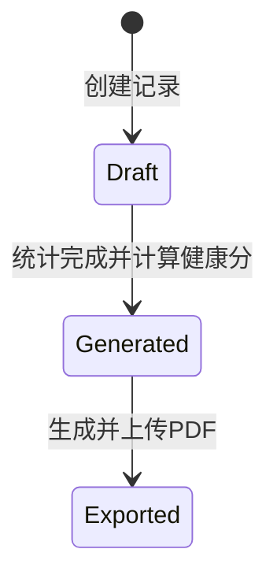

# 健康评估与决策支持模块需求说明文档（Health Analytics Module）

## 1. 背景与目标
模具在高强度生产场景下会持续累积磨损、故障与维修成本；保养是否及时、故障是否频繁、单位成本是否上升，都会直接影响产线稳定性与交付风险。

本模块面向管理层提供周期化的“健康评估报告”，并通过综合健康评分与规则化建议，帮助管理层进行如下决策：
1. 判断模具风险等级与优先级（维保资源如何分配）
2. 识别异常趋势（故障率/维修成本是否持续恶化）
3. 输出可追溯的报告归档材料（可导出 PDF 并长期存档）

## 2. 范围界定
### 2.1 本期范围（V1）
1. 自动生成周期性健康评估报告：周/月/季度
2. 综合健康评分计算：基于使用频次、故障率、保养完成率、成本等指标
3. PDF 报告导出与存档：生成后上传到 MinIO，并记录归档路径
4. 管理层决策支持：提供风险分级、列表/排行榜视图与规则化建议

### 2.2 不在本期范围（V1）
1. 机器学习/深度预测（仅做规则与统计口径）
2. 复杂排产优化（仅给出建议与风险提示）

## 3. 术语与指标口径
### 3.1 报告周期
报告周期类型与统计窗口：
1. 周：`report_period_start` ~ `report_period_end`（按日期，边界包含）
2. 月：同上
3. 季度：同上

> 说明：实现时建议统一使用数据库时区（本项目 `serverTimezone=Asia/Shanghai`），并对日期边界使用 `>= start` 且 `<= end` 口径。

### 3.2 健康报告状态（`health_reports.status`）
1. `1`=草稿（Draft）：尚未生成或仅保存统计结果但未完成导出
2. `2`=已生成（Generated）：完成统计与评分计算
3. `3`=已导出（Exported）：PDF 已生成并存档

### 3.3 数据字段（`health_reports`）定义
核心表：`health_reports`，字段如下（部分为统计结果、部分为计算结果、部分为归档结果）：
1. `mold_id`：模具ID
2. `report_period_start`：周期开始日期
3. `report_period_end`：周期结束日期
4. `total_usage_count`：周期内使用次数
5. `total_production_time`：周期内生产时长（小时）
6. `fault_count`：周期内故障次数（维修事件次数）
7. `repair_cost_total`：周期内维修总成本（元）
8. `maintenance_completed_count`：已完成保养次数
9. `maintenance_planned_count`：计划保养次数
10. `maintenance_rate`：保养完成率（%）
11. `health_score`：综合健康评分（0~100，越高越好）
12. `pdf_file_path`：生成的 PDF 文件存储路径（归档）
13. `generated_by` / `generated_at`：生成人/时间

## 4. 角色与权限
结合现有 `RoleEnum`（`ADMIN/INSPECTOR/OPERATOR/USER`），本模块建议权限如下：
1. `ADMIN`：可生成报告、可导出 PDF、可查看所有模具的报告与排行榜
2. `INSPECTOR`：可查询与查看（可选：允许生成，但通常建议由 ADMIN 发起）
3. `OPERATOR/USER`：仅可查看与其权限范围相关的模具（如有业务约束；V1 可先限制为只读/仅查看）

PDF 导出属于敏感操作，需与“数据可见范围”一致校验（避免跨模具越权）。

## 5. 数据模型与字段映射
### 5.1 统计输入数据来源
1. 使用频次/生产时长
   - 来源表：`mold_usage_records`
   - 实现关联：`MoldUsageRecords` / `UseRecordMapper`
2. 故障次数与维修成本
   - 来源表：`repair_records`
   - 实现关联：`RepairRecordMapper`
3. 保养完成次数与成本（如用于扩展）
   - 来源表：`maintenance_logs`
   - 实现关联：`MaintenanceLogMapper`
4. 保养计划次数（计划口径推导）
   - 来源表：`maintenance_plans`（按模板与周期窗口计算计划发生次数）
   - 实现关联：`MaintenancePlanMapper`

### 5.2 口径约定（用于可复现）
V1 采用“可落地且可复算”的统一口径（实现时必须保持与文档一致）：
1. `total_usage_count`：统计 `mold_usage_records` 中满足 `actual_start_time/actual_end_time` 完整的使用记录，且使用结束时间 `actual_end_time` 落在周期窗口内，记为一次使用。
2. `total_production_time`：对上述记录求时长 `actual_end_time - actual_start_time`，并累加为小时（小数允许，最终可保留 2 位或 4 位再入库）。
3. `fault_count`：统计 `repair_records` 中 `start_time` 落在周期窗口内的维修事件次数；若 `status` 存在“待处理(1)”，可配置是否纳入故障计数（默认纳入：status != 1）。
4. `repair_cost_total`：对上述故障事件的 `cost` 求和；`cost` 为 NULL 视为 0。
5. `maintenance_completed_count`：统计 `maintenance_logs` 中保养完成时间落在周期窗口内的记录数；完成时间优先用 `actual_end_time`，若为空则退回 `created_at`。
6. `maintenance_planned_count`：按保养模板 `maintenance_plans` 与周期窗口推导（详见第 8 节）。
7. `maintenance_rate`：`maintenance_completed_count / max(maintenance_planned_count, 1) * 100`，并保留 2 位小数。

## 6. 功能需求
### 6.1 周期性健康报告生成（周/月/季度）
1. 系统支持周期类型：`WEEKLY/MONTHLY/QUARTERLY`
2. 生成对象：
   - 默认：所有在库/使用中模具（`molds.current_status` 可用于过滤，V1 建议纳入状态 `1/2/3`）
   - 可选：仅指定 `moldId` 生成（管理层手动触发）
3. 生成流程：
   - 计算统计指标（第 5 节）
   - 计算综合健康评分（第 7 节）
   - 写入 `health_reports`：若已存在相同 `(mold_id, report_period_start, report_period_end)` 的记录，则按状态进行更新或跳过（见第 9 节幂等性）
4. 输出：
   - `status=2`（已生成）
   - 记录 `generated_by` 与 `generated_at`

### 6.2 综合健康评分计算
综合健康评分 `health_score` 满足：
1. 范围：`0 ~ 100`
2. 数值含义：越高表示风险越低、健康状况越好
3. 指标包含：使用频次（使用风险）、故障率（维修频繁度）、保养完成率（维护是否及时）、成本（单位成本风险）

### 6.3 PDF 报告导出与存档
1. 报告生成后支持导出 PDF（可自动导出或管理层手动导出）
2. PDF 生成内容：
   - 模具基础信息（编号/名称/类别/当前状态）
   - 周期统计指标表（使用次数、生产时长、故障次数、维修成本、保养完成/计划/完成率）
   - 综合健康评分与风险分级
   - 管理层建议（规则化要点）
   - 指标计算口径说明（用于审计/可复现）
3. 存档：
   - PDF 上传到 MinIO
   - `health_reports.pdf_file_path` 记录归档路径（objectName 或可访问路径，需与 MinIO 工具口径一致）
   - 成功后更新 `health_reports.status=3`

### 6.4 管理层决策支持
1. 风险分级视图：按健康分级（优良/关注/风险/紧急）聚合展示
2. 排名与筛选：支持按 `health_score` 排序
3. 建议生成（规则化）：
   - 若 `maintenance_rate` 低：建议提高保养优先级，检查是否存在保养计划执行缺口
   - 若 `fault_rate` 高：建议评估故障原因，安排专项检修
   - 若 `repair_cost_total` 或 `cost_rate` 高：建议复盘维修成本构成，优化备件/工艺

## 7. 健康评分计算（默认规则）
### 7.1 计算步骤概览
1. 输入指标（第 5 节口径）-> 获取 `U, T, F, C, MC, MP`
2. 计算派生指标：
   - `maintenance_rate = MC / max(MP, 1)`
   - `fault_rate = F / max(U, 1)`
   - `cost_rate = C / max(T, 1)`（元/小时）
3. 指标归一化到 `[0,1]`（越大越好）
4. 加权合成并映射到 `0~100`
5. 进行风险分级并可生成建议要点（第 6.4）

### 7.2 指标归一化与加权合成（推荐默认）
定义常量（建议配置化）：
1. `k_usage_time`：使用/产时风险归一化常量（默认 `T` 的“基准尺度”，如 100 小时）
2. `k_fault`：故障计数归一化常量（默认 `1.5`）
3. `k_cost_rate`：单位成本风险归一化常量（默认 `200` 元/小时）
4. 权重（默认）：
   - 使用风险权重 `w_usage = 0.15`
   - 故障率权重 `w_fault = 0.35`
   - 保养完成率权重 `w_maintenance = 0.35`
   - 成本权重 `w_cost = 0.15`

归一化公式（单项评分越大越好）：
1. 使用风险得分 `usageScore`（高产时通常意味着磨损更大，健康分降低）：
   - `usageRisk = T / (T + k_usage_time)`
   - `usageScore = 1 - usageRisk`
2. 故障率得分 `faultScore`：
   - `faultScore = 1 - (F / (F + k_fault))`
3. 保养完成率得分 `maintenanceScore`：
   - `maintenanceScore = MC / max(MP, 1)`
4. 成本得分 `costScore`：
   - `costScore = 1 / (1 + (cost_rate / k_cost_rate))`

加权合成：
- `healthScoreRaw = w_usage*usageScore + w_fault*faultScore + w_maintenance*maintenanceScore + w_cost*costScore`
- `healthScore = round(healthScoreRaw * 100)`

边界处理：
1. 任意输入为 NULL：按 0 处理
2. `U=0` 或 `T=0`：fault/cost 分母保护由 `max(x,1)` 完成，避免除 0
3. `healthScore` 最终 clamp 在 `[0,100]`

### 7.3 风险分级阈值（默认）
1. `health_score >= 85`：优良
2. `70 <= health_score < 85`：关注
3. `50 <= health_score < 70`：风险
4. `health_score < 50`：紧急

> 说明：分级阈值建议配置化，便于后续调参与试运行。

## 8. 计划完成率口径（maintenance_planned_count）
`maintenance_rate` 由 `maintenance_completed_count / maintenance_planned_count` 得出；因此 `maintenance_planned_count` 的推导必须清晰且可复算。

V1 基于 `maintenance_plans` 的两类策略（现有系统使用 `intervalHours` vs `scheduledDayOfMonth` 二选一）：
1. 时间周期计划（`scheduledDayOfMonth` 不为空，对应提醒类型 `reminderType=1`）
2. 使用次数周期计划（`intervalHours` 不为空，对应提醒类型 `reminderType=2`，此处 interval 语义为“使用间隔”）

### 8.1 时间周期计划（按月固定日推导）
对给定模具的单个保养计划（V1 假设“每模具只有一条保养计划”，与现有实现保持一致），在统计窗口内的计划发生次数：
1. 计算窗口内涉及的月份集合（`report_period_start` 到 `report_period_end` 的所有月份）
2. 对每个月：
   - `dueDate = 该月的 scheduledDayOfMonth（超过当月天数则取当月最后一天）`
3. 若 `dueDate` 落在窗口内（`>= start` 且 `<= end`），则 `plannedCount++`

输出：
- `maintenance_planned_count = plannedCount`

### 8.2 使用次数周期计划（按窗口内使用次数推导）
由于现有表结构缺少“计划触发历史”的明细（每个模具+计划仅保留一条 reminder 记录，且会滚动覆盖下一次到期值），V1 的计划次数采用可复算的近似口径：
1. 从第 5 节已计算的 `total_usage_count = U` 得到周期内使用次数
2. 计划周期间隔记为 `interval = intervalHours`（默认按整数使用间隔）
3. 计划次数推导：
   - `maintenance_planned_count = floor(U / max(interval,1))`

约束与说明：
1. 若该模具在周期内使用次数为 0，则计划次数也为 0，`maintenance_rate` 计算时按 `max(MP,1)` 保护
2. 该口径适用于“周期初值从 0 开始的近似评估”，用于形成健康评分；如需精确对齐累计计数基线，建议后续在数据模型中补充基线字段或历史表（可作为二期增强）

### 8.3 maintenance_rate 计算
- `maintenance_rate = (maintenance_completed_count / max(maintenance_planned_count, 1)) * 100`

## 9. 报告生成与幂等性要求
### 9.1 状态迁移（示意）

### 9.2 幂等性策略
为了避免重复统计/重复写入：
1. 建议在实现中对 `(mold_id, report_period_start, report_period_end)` 建立唯一约束或使用逻辑幂等：
   - 若存在记录且 `status=3`：则跳过导出/不重复生成
   - 若存在记录且 `status<3`：允许重新生成并更新 `status=2`
2. PDF 导出幂等：
   - 若 `status=3` 且 `pdf_file_path` 非空：直接返回，不重复上传
   - 若 `status=2`：允许导出并更新路径与状态

## 10. 调度与接口需求
### 10.1 定时任务
建议采用“日/周/月触发点”的 cron 配置，避免跨时区与边界问题：
1. 周报：建议每周一 00:10 触发（统计上一周窗口）
2. 月报：建议每月第一天 00:10 触发（统计上月窗口）
3. 季度报：建议每季度第一天 00:10 触发（统计上个季度窗口）

定时任务需要：
1. 批量计算：按模具分批聚合，避免一次查询/计算过大
2. 重试与告警：失败记录需可追踪

### 10.2 REST API 草案
> 路径命名可按你项目现有风格调整（例如 `/api/health-reports`）。

1. 触发生成（手动）
   - `POST /api/health-reports/generate`
   - 请求体：
     - `periodType`：`WEEKLY|MONTHLY|QUARTERLY`
     - `periodStart`：可选，若传则用自定义窗口
     - `periodEnd`：可选
     - `moldId`：可选；不传则全量
   - 响应：
     - `code=200`，返回生成数量/跳过数量/失败数量

2. 查询单条报告
   - `GET /api/health-reports/{id}`

3. 分页查询报告列表
   - `POST /api/health-reports/query`
   - 请求体：支持 `moldId、periodType、start/end、status、minHealthScore/maxHealthScore`

4. 导出 PDF
   - `POST /api/health-reports/{id}/export-pdf`
   - 返回：`pdfFilePath` 或可访问 URL

5. 获取 PDF 下载/预览地址
   - `GET /api/health-reports/{id}/pdf-url?expiresDays=7`

6. 管理层决策看板数据（汇总/排行榜）
   - `GET /api/health-reports/summary?periodType=MONTHLY&periodStart=...&periodEnd=...`
   - 返回建议字段：
     - `totalMolds`
     - `countByRiskLevel`
     - `topNByLowestHealthScore`
     - `recommendedActions`

## 11. PDF 报告导出与存档
### 11.1 PDF 生成策略（推荐）
V1 推荐“服务端渲染 HTML -> 转 PDF”方式，因为报告内容包含多表格与图形化布局，HTML 更易维护模板。

候选实现（需求层面给出选择建议，后续落地再确定）：
1. 采用 `OpenHTMLtoPDF`（HTML/CSS 渲染到 PDF，适配服务端渲染）
2. HTML 模板建议使用 Thymeleaf 或 FreeMarker：
   - 本项目当前 `pom.xml` 未显式引入 PDF 生成依赖，PDF 方案需要新增依赖与模板引擎（作为实现任务）

### 11.2 模板内容与样式
PDF 版式建议：
1. 页眉：模具编号/名称、报告标题、周期
2. 页内：指标汇总表 + 评分与分级
3. 建议模块：可折叠字段或固定条目（3~5 条）
4. 口径说明附录：简明列出各指标统计口径与默认公式参数范围

### 11.3 MinIO 存档策略
1. 上传入口：复用现有 `MinioUtil` 上传能力
2. 存储路径建议（objectName 规范）：
   - `health-reports/{moldId}/{periodType}/{reportId}.pdf`
3. 回写：
   - 写入 `health_reports.pdf_file_path`
4. 访问：
   - 下载可复用现有 `MinioController` 的 `/download` 或提供本模块的 `/pdf-url` 以返回预签名 URL

## 12. 管理层决策支持规则化建议（示例）
建议模块输入：
- `fault_rate / fault_count`
- `maintenance_rate`
- `cost_rate`
- `health_score`

建议生成规则（V1 示例）：
1. 若 `health_score < 50`：
   - 优先级：最高
   - 建议：
     - 故障排查：检查故障类型集中度（可扩展接入异常报警表）
     - 维保缺口：维护完成率低于阈值（例如 `<70%`）
2. 若 `maintenance_rate < 80%` 且 `fault_rate 升高`：
   - 建议：在下一个计划周期中提高保养频率/覆盖范围
3. 若 `cost_rate > cost_high_threshold`：
   - 建议：对维修成本结构进行复盘，评估备件与工艺优化

> 注：后续可将规则沉淀为可配置策略表，与报警引擎形成复用（二期增强）。

## 13. 非功能需求
### 13.1 性能与容量
1. 全量生成需支持分批：
   - 每次处理 N 个模具（例如 50~500，按数据库压力调整）
2. 统计尽量使用 SQL 聚合（COUNT/SUM）减少 Java 侧遍历

### 13.2 一致性与事务
1. 生成统计结果写入 `health_reports` 需保证事务一致（统计->写入）
2. PDF 导出与 MinIO 上传可能耗时：
   - 建议导出与上传使用独立事务或补偿机制

### 13.3 安全性
1. 接口鉴权：基于现有 Spring Security/Token 机制
2. 数据权限：查询与导出均需校验模具可见范围
3. 防止越权导出：仅允许有权限的角色导出

### 13.4 可观测性与审计
1. 生成任务需记录日志：开始/结束/模具批次/失败原因
2. PDF 上传需记录归档路径与返回结果（成功/失败）

## 14. 异常与边界情况
1. `maintenance_planned_count=0`：
   - `maintenance_rate` 采用 `max(MP,1)` 保护；分级建议在文案中提示“计划次数为 0 的特殊情况”
2. 维修成本为 NULL：
   - `repair_cost_total` 中按 0 处理
3. 缺少 actual_start/actual_end：
   - usage 统计仅纳入完整数据记录（V1 策略），避免把计划数据误算为生产实际
4. PDF 生成失败：
   - 保持 `health_reports.status=2` 并记录错误原因，允许重试导出

## 15. 测试与验收标准
### 15.1 单元测试
1. 健康评分计算：
   - 覆盖边界：0 故障、0 生产时长、0 计划保养、成本为 NULL
   - 覆盖 clamp：确保 `0<=health_score<=100`
2. planned_count 计算：
   - 时间计划：跨月/跨季度、scheduledDay 大于当月天数的处理
   - 使用计划：验证 `floor(U/interval)` 口径

### 15.2 集成测试
1. 生成幂等性：
   - 重复触发同一周期同一模具生成，确保不会产生重复记录或会覆盖到最新评分
2. 导出幂等性：
   - 已导出状态重复调用导出接口，不重复上传
3. 数据正确性：
   - 使用一组固定数据集，验证 `health_reports` 中统计字段与评分字段准确

### 15.3 PDF 验收
1. 导出的 PDF 文件大小 > 0
2. PDF 中必须包含关键字段：周期、指标表、健康分、分级、建议要点
3. `pdf_file_path` 必须可用于再次通过 MinIO 下载/预览（由预签名 URL 验证）

### 15.4 权限验收
1. ADMIN 能查看与导出
2. 非授权角色无法导出（返回 403/401）
3. 非授权模具无法读取其报告（返回 404 或 403，策略按现有项目约定）

## 16. 附录：默认公式参数（建议可配置）
1. `k_usage_time` 默认 `100`
2. `k_fault` 默认 `1.5`
3. `k_cost_rate` 默认 `200`
4. 权重：`w_usage=0.15, w_fault=0.35, w_maintenance=0.35, w_cost=0.15`
5. 风险分级阈值：`85/70/50`

